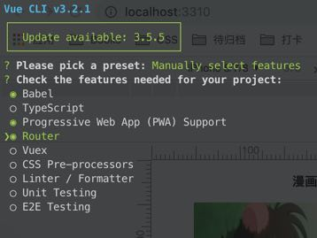

# PWA

## 1. 开始

初始化一个应用

```shell
npm init -y
```

初始化项目结构如下

```html
<!-- index.html -->
<!DOCTYPE html>
<html lang="en">
<head>
  <meta charset="UTF-8">
  <meta name="viewport" content="width=device-width, initial-scale=1.0">
  <meta http-equiv="X-UA-Compatible" content="ie=edge">
  <title>PWA DEMO</title>
  <link rel="stylesheet" href="./style.css">
</head>
<body>
  <div>
    <h3>漫画图片</h3>
    <ul id="content">
      
    </ul>
  </div>
  <script src="./main.js"></script>
</body>
</html>
```

```javascript
// main.js
let content = document.getElementById('content')

let xhr = new XMLHttpRequest();
let str = ''

xhr.open('get', '/api/img', true);

xhr.responseType = "json"

xhr.onload = function() {
  let arr = xhr.response
  arr.forEach(item => {
    str += `<li></li>`
  })
  content.innerHTML = str
}

xhr.send()

```

```css
ul {
  list-style: none
}

li {
  width: 50%;
  display: inline-block;
  height: 150px;
}

img {
  width: 100%;
  height: 100%;
}

h3 {
  text-align: center;
}
```

## 2. 配置Manifest

```html
<!-- index.html -->
<!DOCTYPE html>
<html>
  <head>
  	<!-- ... -->
    <link rel="manifest" href="./manifest.json" />
  </head>
</html>
```

```json
{
  "name": "weisuoke",
  "short_name": "suoye",
  "display": "standalone",
  "start_url": "/index.html",
  "icons": [{
    "src": "/test.png",
    "sizes": "144x144",
    "type": "image/png"
  }],
  "background_color": "#aaa",
  "theme_color": "#aaa"
}
```


## 3. SW

PWA 基于 Service Worker

> Service Worker
>
> 为了提升用户体验
>
> Service Worker特点：
>
> 1. 不能访问 / 操作 DOM
> 2. 会自动休眠，不会随浏览器关闭失效(必须手动卸载)
> 3. 离线缓存内容开发者可控
> 4. 必须在https或者localhost下使用
> 5. 所有api都是基于promise

### 3.1 sw 生命周期


- 安装(installing)
- 安装后(installed)
- 激活(activating)
- 激活后(activated)
- 废弃状态(redundant)

sw中的api都是基于Promise的

```html
<!-- index.html -->
<script>
  // 需要加载 service worker
  window.addEventListener('load', () => {
    // 解决离线缓存的问题 1. 缓存。2. 把缓存取出来
    if ('serviceWorker' in navigator) { // 当前支持了 serviceWorker
      navigator.serviceWorker.register('/sw.js').then(registeration => {
        console.log(registeration)
      })
    }
  })
  // (index): 1 Site cannot be installed: the page does not work offline
  // serviceWorker 需要拦截我们客户的请求
</script>
```

```javascript
// sw.js

// 缓存至 Cache Storage 中的名字 
const CACHE_NAME = 'cache_v' + 2; // 默认情况下 sw文件变化后会重新注册serviceWorker

// 缓存列表，适当缓存
const CACHE_LIST = [
  '/',
  '/index.html',
  '/style.css',
  '/main.js',
  '/api/img'
]

self.addEventListener('fetch', (e) => {
  console.log(e.request.url)
})

// 缓存，需要缓存内容
function preCache() {
  // 开启一个缓存空间
  return caches.open(CACHE_NAME).then(cache => {
    // 添加列表到缓存中
    return cache.addAll(CACHE_LIST)
  })
}

self.addEventListener('install', (e) => {
  // 如果上一个serviceWorker不销毁 需要手动skipWaiting
  console.log('install')
  // 一安装就缓存 CACHE_LIST 中的内容
  e.waitUntil(
    preCache().then(skipWaiting)
  ) // 等待Promise执行完成
})

function clearCache() {
  return caches.keys().then(keys => {
    return Promise.all(keys.map(key => {
      if (key !== CACHE_NAME) {
        return caches.delete(key)
      }
    }))
  })
}

// 激活当前 service worker，让 serviceWorker 立即失效。self.clients.claim()
// 当前 serviceWorker 安装完毕后
self.addEventListener('activate', (e) => {
  console.log('activate')
  e.waitUntil(
    Promise.all([
      clearCache(), // 清缓存
      self.clients.claim()
    ])
  )
})

// 添加主屏幕 两次访问 间隔5分钟 会弹出横条
// 手动点没问题
```


### 3.2 请求

联网的话就发请求，在sw.js线程中不能发送ajax请求，可以使用fetch api

```javascript
// sw.js

function fetchAddSave(request) { // 获取数据后 进行缓存
  // 如果请求到了，需要更新缓存
  return fetch(request).then(data => {
    // 更新缓存
    let r = res.clone();  // 克隆一份放到缓存中, res必须克隆，因为使用一次就销毁了
    caches.open(CACHE_NAME).then(cache => cache.put(request, res))
    return res
  })
}

self.addEventListener('fetch', (e) => { // 线程中 不能发ajax => fetch fetchApi
  // 如果联网的话就发送请求

  // workbox
  // 缓存策略 缓存优先 网络优先
  // 内置了缓存策略
  // 1. cachefirst 缓存优先
  // 2. cacheonly 仅缓存
  // 3. networkfirst 网络优先
  // 4. networkonly 仅网络
  // 5. StaleWithRevalidate 从缓存取，用网络数据更新缓存

  if (e.request.url.includes('/api/')) {
    return e.respondWith(
      fetchAddSave(e.request).catch(err => {
        // 打开缓存把缓存中匹配的结果 返还回去
        return caches.open(CACHE_NAME).then(cache => cache.match(e.request))
      })
    )
  }

  e.respondWith(
    // 用什么内容返回当前响应
    fetch(e.request).catch(err => {
      // 打开缓存把缓存中匹配的结果 返还回去
      return caches.open(CACHE_NAME).then(cache => cache.match(e.request))
    })
  )
  console.log(e.request.url)
})
```

## 4. 在Vue中使用PWA

### 4.1 生成一个新的项目

使用vue-cli生成一个新的vue项目

```shell
vue create pwa-vue-project
```



> vue在使用pwa的时候只有在打包之后才生效，打包的时候不生效。

```shell
# 生成好了直接打包
npm run build

# 启动服务
http-server
```


```javascript
// registerServiceWorker.js
/* eslint-disable no-console */

import { register } from 'register-service-worker'

if (process.env.NODE_ENV === 'production') {
  register(`${process.env.BASE_URL}service-worker.js`, {
    ready () {
      console.log(
        'App is being served from cache by a service worker.\n' +
        'For more details, visit https://goo.gl/AFskqB'
      )
    },
    registered () {
      console.log('Service worker has been registered.')
    },
    cached () {
      console.log('Content has been cached for offline use.')
    },
    updatefound () {
      console.log('New content is downloading.')
    },
    updated () {
      console.log('New content is available; please refresh.')
    },
    offline () {
      console.log('No internet connection found. App is running in offline mode.')
    },
    error (error) {
      console.error('Error during service worker registration:', error)
    }
  })
}

```

### 4.2 配置 PWA

vue-cli3.0配置pwa，在public目录下可以更改manifest配置文件

```javascript
// vue.config.js

module.exports = {
  pwa: {
    name: 'My App',
    themeColor: '#f2f2f2',
    msTileColor: '#aaaaaa',
    appleMobileWebAppCapable: 'yes',
    appleMobileWebAppStatusBarStyle: 'black',
    workboxPluginMode: 'InjectManifest',
    workboxOptions: {
      // swSrc is required in InjectManifest mode.
      swSrc: 'dev/service-worker.js'
    }
  }
}
```

打包出来的service-worker.js

```javascript
// dev/service-worker.js。
// 执行npm run build时，用这份service-worker.js

// 缓存的名字
workbox.core.setCacheNameDetails({prefix: "pwa-vue-project"});
// 缓存列表
self.__precacheManifest = [].concat(self.__precacheManifest || []);
workbox.precaching.suppressWarnings();
// 把文件列表缓存起来
workbox.precaching.precacheAndRoute(self.__precacheManifest, {});

// 新增缓存策略
workbox.routing.registerRoute(
  function(obj) { // 函数返回 true 则缓存
    // 包含 api 的就缓存下来
    return obj.url.href.includes('/user')
  },
  workbox.strategies.staleWhileRevalidate() // 使用这个缓存策略
)

// workbox 专门做缓存的库

// 首屏渲染 loading效果 --> 骨架屏
// Vue中有现成的插件。
```

### 4.3 骨架屏

> app-skeleton
>
> 配置webpack插件 vue-skeleton-webpack-plugin

> vue.config.js 中
>
> chainWebpack 与 configureWebpack 的区别
>
> chainWebpack 连接到webpack的内部
>
> configureWebpack 给Webpack 新增一些配置

```javascript
// vue.config.js
module.exports = {
  // ...
  configureWebpack: {
    plugins: [
      new SkeletonWebpackPlugin({
        webpackConfig: {
          entry: {
            app: path.resolve(__dirname, './src/skeleton.js')
          }
        }
      })
    ]
  } // webpack-merge
  // ...
}
```

```javascript
// src/skeleton.js
import Vue from 'vue'
import Skeleton from './skeleton.vue'

export default new Vue({
  components: {
    Skeleton
  },
  template: `<Skeleton></Sketeton>`
})
```

```vue
<!-- src/skeleton.vue -->
<template>
  <div>
    这是首页 一般放置 base64 图片，因为 base64 图片比较快
  </div>
</template>
```


### 4.4 路由切换的骨架屏

```javascript
// src/skeleton.js
import Vue from 'vue'
import SkeletonA from './skeletonA.vue'
import SkeletonB from './skeletonB.vue'

export default new Vue({
  components: {
    SkeletonA,
    SkeletonB
  },
  template: `
    <div>
      <SkeletonA style="display:none;" id="skeletonA"></SkeletonA>
      <SkeletonB style="display:none;" id="skeletonB"></SkeletonB>
    </div>
  `
})
```

```javascript
let SkeletonWebpackPlugin =  require('vue-skeleton-webpack-plugin')
let path = require('path')

module.exports = {
  pwa: {
    name: 'My App',
    themeColor: '#f2f2f2',
    msTileColor: '#aaaaaa',
    appleMobileWebAppCapable: 'yes',
    appleMobileWebAppStatusBarStyle: 'black',
    workboxPluginMode: 'InjectManifest',
    workboxOptions: {
      // swSrc is required in InjectManifest mode.
      swSrc: 'dev/service-worker.js'
    }
  },
  configureWebpack: {
    plugins: [
      new SkeletonWebpackPlugin({
        webpackConfig: {
          entry: {
            app: path.resolve(__dirname, './src/skeleton.js')
          }
        },
        // 路由切换骨架屏
        router: {
          mode: 'history',
          routes: [
            {
              path: '/',
              skeletonId: 'skeletonA'
            },
            {
              path: '/about',
              skeletonId: 'skeletonB'
            }
          ]
        }
      })
    ]
  } // webpack-merge
}
```

### 4.5 简单实现骨架屏插件

```javascript
// 所有的 webpack 插件都是一个类，类中必须要提供一个 apply 方法。apply 方法中要传入一个对象compiler。当前对象代表的就是当前编译的 webpack
class MyPlugin {
  apply(compiler) { // compiler 代表的是当前整个webpack打包对象
    compiler.plugins('compilation', (compilation) => {  // compilation 当前这次打包的时候产生
      compilation.plugins(
        'html-webpack-plugin-before-html-processing', // 监听这个插件
        (data) => { // 脚本替换
          data.html = data.html.replace(`<div id="app"></div>`, `
            <div id="#app">
              <div id="app">
                <div id="home" style="display: none;">首页 骨架屏</div>
                <div id="about" style="display: none;">about页面骨架屏</div>
              </div>
              <script>
                if (window.hash == '#/about' || location.pathname == '/about') {
                  document.getElementById('about').style.display = "block"
                } else {
                  document.getElementById('home').style.display = "block"
                }
              </script>
            </div>
          `)
        }
      )
    })
  }
}
```


## Q & A

- 骨架屏
- 实现骨架屏插件

