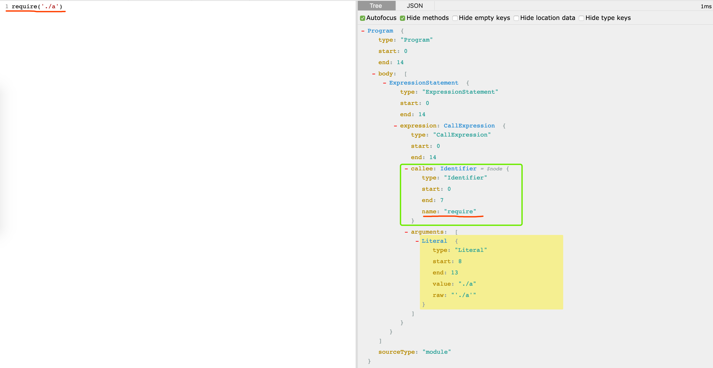
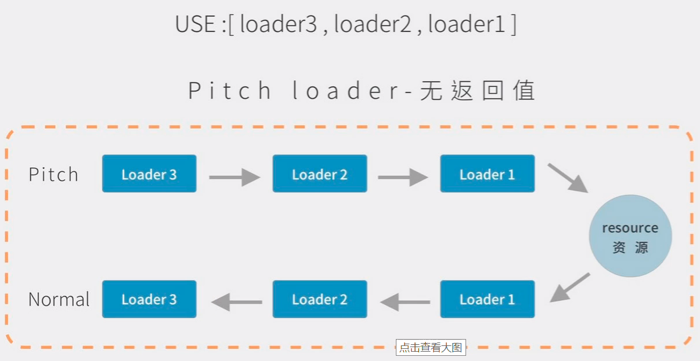
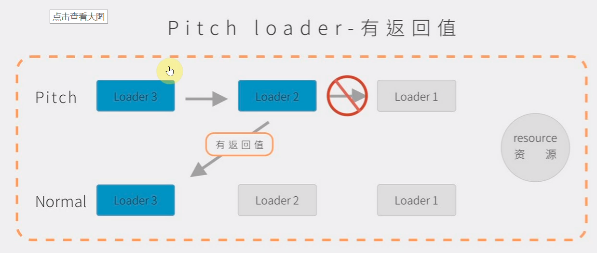

# 手写Webpack

## 1. 开始

肯定是需要 Webpack 打包出来，看下打包后的结果。根据打包后的结果实现这样一套 Webpack，写这样一套Webpack。

首先，先打包出来一个webpack的文件 `bundle.js`

```javascript
// webpack打包出来精简后的代码
(function (modules) {
  var installedModules = {};
  // webpack 这里自己实现了一个 required 方法	
  function __webpack_require__(moduleId) {

    if (installedModules[moduleId]) {
      return installedModules[moduleId].exports;
    }

    var module = installedModules[moduleId] = {
      i: moduleId,
      l: false,
      exports: {}
    };

    modules[moduleId].call(module.exports, module, module.exports, __webpack_require__);

    module.l = true;

    return module.exports;
  }
  
  // 默认的话会去引用我们的主文件，我们的主文件就是 `src/index.js`。这里确定入口文件。
  return __webpack_require__(__webpack_require__.s = "./src/index.js");
})
({
  // 在对象执行的时候，传入一个参数，参数分别的对应的key 和 value。key 就是我们当前文件的相对路径。value,就是当前的一个代码块。然后后面就会引入 n个代码块。
  "./src/a.js":
    (function (module, exports, __webpack_require__) {
      eval("let b = __webpack_require__(/*! ./base/b.js */ \"./src/base/b.js\");\n\nmodule.exports = 'a' + b;\n\n\n//# sourceURL=webpack:///./src/a.js?");
    }),
  "./src/base/b.js":
    (function (module, exports) {
      eval("module.exports = 'b'\n\n//# sourceURL=webpack:///./src/base/b.js?");
    }),
  "./src/index.js":
    (function (module, exports, __webpack_require__) {
      eval("let str = __webpack_require__(/*! ./a.js */ \"./src/a.js\");\nconsole.log(str);\n\n//# sourceURL=webpack:///./src/index.js?");
    })
});
```

新建一个文件夹 `wx-pack`, 初始化 `npm init -y`

```json
{
  "name": "wx-pack",
  "version": "1.0.0",
  "description": "",
  "main": "index.js",
  "scripts": {
    "test": "echo \"Error: no test specified\" && exit 1"
  },
  "bin": {
    "wx-pack": "./bin/wx-pack.js"
  },
  "keywords": [],
  "author": "",
  "license": "ISC"
}

```

建立一个`bin`文件，在`bin`文件下面创建一个`wx-pack.js`这个文件，

```javascript
#! /usr/bin/env node

console.log('start');
```

使用 `npm link`将命令链接到全局


## 2. webpack 分析及处理

现在用`wx-pack`这个打包工具，拿到文件根目录中的`webpack.config.js`, 根据这个配置进行编译代码。

```javascript
#! /usr/bin/env node

let path = require('path');

// config 配置文件
let config = require(path.resolve('webpack.config.js'));

// 引入这个类
let Compiler = require('../lib/Compiler.js')
// 写一个专门用来编译的类，可以编译，编译了以后将配置传进去。
let compiler = new Compiler(config)

// compiler 上面有一个 run 方法。标识运行编译。
compiler.run()
```


```javascript
// lib/Compiler.js
class Compiler {
  constructor(config) {
    // entry output
    this.config = config;
    // 需要保存入口文件的路径
    this.entryId; // 主模块路径 './src/index.js'
    // 需要保存所有模块依赖
    this.modules = {};
    this.entry = config.entry;  // 入口路径
    // 这个就是我们运行 npx 的路径，工作路径。
    this.root = process.cwd();
  }
  buildModule(modulePath, isEntry) {

  }
  emitFile() {  // 发射文件

  }
  run() {
    // 执行
    // 解析当前文件的依赖，把文件变成类似 Webpack 打包出来的模样。
    // 入口文件的主路径放在指定的位置

    // 创建模块的依赖关系
    this.buildModule(path.resolve(this.root, this.entry), true);
    // 根据工作路径，和当前文件的名字。就可以读到当前文件的内容；根据文件中的内容编译依赖关系。

    // 发射一个打包后的文件
    this.emitFile();
  }
}

module.exports = Compiler;
```

## 3. 创建依赖关系

<span style="color: red;">*编写 lib/Compiler.js*</span>

```javascript
let fs = require('fs');
let path = require('path');

class Compiler {
  constructor(config) {
    // entry output
    this.config = config;
    // 需要保存入口文件的路径
    this.entryId; // 主模块路径 './src/index.js'
    // 需要保存所有模块依赖
    this.modules = {};
    this.entry = config.entry;  // 入口路径
    // 这个就是我们运行 npx 的路径，工作路径。
    this.root = process.cwd();
  }
  
  // 获取源码
  getSource(modulePath) {
    let content = fs.readFileSync(modulePath, 'utf8');
    return content;
  }
  
  // 解析源码
  parse(source, parentPath) { // 靠 AST 解析语法树
    console.log(source, parentPath)
  }
  
  // 构建模块
  buildModule(modulePath, isEntry) {
    // 拿到模块的内容
    let source = this.getSource(modulePath)
    // 模块id
    // 模块id需要改造一下，我们拿到的path是一个绝度路径，打包出来的是一个相对路径
    // 模块id modulePath = modulePath - this.root
    let moduleName = './' + path.relative(this.root, modulePath);  // 根据两个路径的差来获取相对路径

    if (isEntry) {
      this.entryId = moduleName;  // 保存入口的名字
    }
    // 把模块中的的内容 require 解析成 __webpack_require__
    // 把引用路径变成 ./src/a.js
    // 这里就要解析我们的源码, 需要把source源码进行改造，返回一个依赖列表
    let {sourceCode, dependencies} = this.parse(source, path.dirname(moduleName)); // ./src
    // 把相对路径和模块中的内容对应起来
    this.modules[moduleName] = sourceCode;
  }
  emitFile() {  // 发射文件

  }
  run() {
    // 执行
    // 解析当前文件的依赖，把文件变成类似 Webpack 打包出来的模样。
    // 入口文件的主路径放在指定的位置

    // 创建模块的依赖关系
    this.buildModule(path.resolve(this.root, this.entry), true);
    // 根据工作路径，和当前文件的名字。就可以读到当前文件的内容；根据文件中的内容编译依赖关系。

    // 发射一个打包后的文件
    this.emitFile();
  }
}

module.exports = Compiler;
```

## 4. AST 解析语法树

用到 babel 那一套，需要下面三个模块
- babylon 主要是把源码转换成 AST
- @babel/traverse 遍历节点
- @babel/types 替换节点
- @babel/generator 把遍历好的节点生成

AST 解析如下:


[AST在线解析网站](https://astexplorer.net/)

### 参考阅读

- [AST抽象语法树——最基础的javascript重点知识，99%的人根本不了解](https://segmentfault.com/a/1190000016231512)

```javascript
// lib/Compiler.js

// 编写类Compiler中的parse函数

let fs = require('fs');
let path = require('path');
let babylon = require('babylon');
let traverse = require('@babel/traverse').default;
let t = require('@babel/types');
let generator = require('@babel/generator').default;

class Compiler {
  constructor(config) {
    // entry output
    this.config = config;
    // 需要保存入口文件的路径
    this.entryId; // 主模块路径 './src/index.js'
    // 需要保存所有模块依赖
    this.modules = {};
    this.entry = config.entry;  // 入口路径
    // 这个就是我们运行 npx 的路径，工作路径。
    this.root = process.cwd();
  }
  
  // 获取源码
  getSource(modulePath) {
    let content = fs.readFileSync(modulePath, 'utf8');
    return content;
  }
  
  // 解析源码
  parse(source, parentPath) { // 靠 AST 解析语法树
    // 这里使用 babel 的一些东西

    // 解析 AST
    let ast = babylon.parse(source);
    let dependencies = [];  // 依赖的数组
    // 遍历 AST
    traverse(ast, {
      CallExpression(p) {  // 什么是调用表达式 a() require() 上述两个都叫做调用表达式
        // 只有 require 的时候 需要去管
        let node = p.node;  // 对应的节点
        if (node.callee.name === 'require') {
          node.callee.name = '__webpack_require__';
          let moduleName = node.arguments[0].value;  // 渠道的是模块的引用名字
          moduleName = moduleName + (path.extname(moduleName) ? '' : '.js') // 补全 module 的名字
          moduleName = './' + path.join(parentPath, moduleName);  // 'src/a.js
          dependencies.push(moduleName); // 将模块名放入到依赖列表
          // 把默认 AST 也转换一下
          node.arguments = [t.stringLiteral(moduleName)]
        }
      }
    })
    let sourceCode = generator(ast).code;
    return {sourceCode, dependencies}
  }
  
  // 构建模块
  buildModule(modulePath, isEntry) {
    // 拿到模块的内容
    let source = this.getSource(modulePath)
    // 模块id
    // 模块id需要改造一下，我们拿到的path是一个绝度路径，打包出来的是一个相对路径
    // 模块id modulePath = modulePath - this.root
    let moduleName = './' + path.relative(this.root, modulePath);  // 根据两个路径的差来获取相对路径

    if (isEntry) {
      this.entryId = moduleName;  // 保存入口的名字
    }
    // 把模块中的的内容 require 解析成 __webpack_require__
    // 把引用路径变成 ./src/a.js
    // 这里就要解析我们的源码, 需要把source源码进行改造，返回一个依赖列表
    let {sourceCode, dependencies} = this.parse(source, path.dirname(moduleName)); // ./src

    console.log(sourceCode, '🍎', dependencies);
    // 把相对路径和模块中的内容对应起来
    this.modules[moduleName] = sourceCode;

    dependencies.forEach(dep => { // 附模块的加载 递归加载
      this.buildModule(path.join(this.root, dep), false)
    })
  }
  emitFile() {  // 发射文件

  }
  run() {
    // 执行
    // 解析当前文件的依赖，把文件变成类似 Webpack 打包出来的模样。
    // 入口文件的主路径放在指定的位置

    // 创建模块的依赖关系
    this.buildModule(path.resolve(this.root, this.entry), true);
    // 根据工作路径，和当前文件的名字。就可以读到当前文件的内容；根据文件中的内容编译依赖关系。
    // 发射一个打包后的文件
    this.emitFile();
  }
}

module.exports = Compiler;
```

## 5. 生成打包结果

补全 `emitFile()`

这里需要用到一个模板，这里使用 `ejs`模板引擎

```shell
npm install ejs --save
```

```ejs
<!-- lib/main.ejs -->

(function (modules) {
  var installedModules = {};

  function __webpack_require__(moduleId) {

    if (installedModules[moduleId]) {
      return installedModules[moduleId].exports;
    }

    var module = installedModules[moduleId] = {
      i: moduleId,
      l: false,
      exports: {}
    };

    modules[moduleId].call(module.exports, module, module.exports, __webpack_require__);

    module.l = true;

    return module.exports;
  }

  return __webpack_require__(__webpack_require__.s = "<%-entryId%>");
})
({
  <%for (let key in modules) {%>
      "<%-key%>":
      (function (module, exports, __webpack_require__) {
        eval(`<%-modules[key]%>`);
      }),
  <%}%>
});
```

```javascript
// lib/Compiler.js

let fs = require('fs');
let path = require('path');
let babylon = require('babylon');
let traverse = require('@babel/traverse').default;
let t = require('@babel/types');
let generator = require('@babel/generator').default;
let ejs = require('ejs');

class Compiler {
  constructor(config) {
    // entry output
    this.config = config;
    // 需要保存入口文件的路径
    this.entryId; // 主模块路径 './src/index.js'
    // 需要保存所有模块依赖
    this.modules = {};
    this.entry = config.entry;  // 入口路径
    // 这个就是我们运行 npx 的路径，工作路径。
    this.root = process.cwd();
  }
  
  // 获取源码
  getSource(modulePath) {
    let content = fs.readFileSync(modulePath, 'utf8');
    return content;
  }
  
  // 解析源码
  parse(source, parentPath) { // 靠 AST 解析语法树
    // 这里使用 babel 的一些东西

    // 解析 AST
    let ast = babylon.parse(source);
    let dependencies = [];  // 依赖的数组
    // 遍历 AST
    traverse(ast, {
      CallExpression(p) {  // 什么是调用表达式 a() require() 上述两个都叫做调用表达式
        // 只有 require 的时候 需要去管
        let node = p.node;  // 对应的节点
        if (node.callee.name === 'require') {
          node.callee.name = '__webpack_require__';
          let moduleName = node.arguments[0].value;  // 渠道的是模块的引用名字
          moduleName = moduleName + (path.extname(moduleName) ? '' : '.js') // 补全 module 的名字
          moduleName = './' + path.join(parentPath, moduleName);  // 'src/a.js
          dependencies.push(moduleName); // 将模块名放入到依赖列表
          // 把默认 AST 也转换一下
          node.arguments = [t.stringLiteral(moduleName)]
        }
      }
    })
    let sourceCode = generator(ast).code;
    return {sourceCode, dependencies}
  }
  
  // 构建模块
  buildModule(modulePath, isEntry) {
    // 拿到模块的内容
    let source = this.getSource(modulePath)
    // 模块id
    // 模块id需要改造一下，我们拿到的path是一个绝度路径，打包出来的是一个相对路径
    // 模块id modulePath = modulePath - this.root
    let moduleName = './' + path.relative(this.root, modulePath);  // 根据两个路径的差来获取相对路径

    if (isEntry) {
      this.entryId = moduleName;  // 保存入口的名字
    }
    // 把模块中的的内容 require 解析成 __webpack_require__
    // 把引用路径变成 ./src/a.js
    // 这里就要解析我们的源码, 需要把source源码进行改造，返回一个依赖列表
    let {sourceCode, dependencies} = this.parse(source, path.dirname(moduleName)); // ./src

    // 把相对路径和模块中的内容对应起来
    this.modules[moduleName] = sourceCode;

    dependencies.forEach(dep => { // 附模块的加载 递归加载
      this.buildModule(path.join(this.root, dep), false)
    })
  }
  emitFile() {  // 发射文件
    // 用数据渲染我们的模板
    // 拿到输出的目录下
    // 输出路径
    let main = path.join(this.config.output.path, this.config.output.filename);
    // 模板路径，把模板中的内容读取出来
    let templateStr = this.getSource(path.join(__dirname, "main.ejs"));
    let code = ejs.render(templateStr, {entryId: this.entryId, modules: this.modules})
    this.assets = {}
    // 资源中路径对应的代码
    this.assets[main] = code;
    fs.writeFileSync(main, this.assets[main])
  }
  run() {
    // 执行
    // 解析当前文件的依赖，把文件变成类似 Webpack 打包出来的模样。
    // 入口文件的主路径放在指定的位置

    // 创建模块的依赖关系
    this.buildModule(path.resolve(this.root, this.entry), true);
    // 根据工作路径，和当前文件的名字。就可以读到当前文件的内容；根据文件中的内容编译依赖关系。
    // 发射一个打包后的文件
    this.emitFile();
  }
}

module.exports = Compiler;
```

以上 webpack的功能比较弱，只能打包模块。下面去开始写一个 `Loader`的功能

## 6. 增加 loader

先给 webpack.config.js 添加两个 loader

在`webpack-dev`项目中新增一个文件夹`loader`，两个js文件`less-loader.js`,`style-loader.js`


其中loader就是一个函数

下面编写两个loader

```javascript
// style-loader
function loader(source) {
  let style = `
    let style = document.createElement('style);
    style.innerHTML = ${JSON.stringify(source)}
    document.head.appendChild(style)
  `
  return style;
}

module.exports = loader
```

```javascript
let less = require('less')

// loader里面就是源码，我们就是要把这个源码进行过滤
function loader(source) {
  let css = '';

  less.render(source, function (err, c) {
    css = c.css
  })
  css = css.replace(/\n/g, '\\n')
  return css;
}

module.exports = loader;
```

现在在我们手写的 Webpack 里面要匹配，如果路径是以 less 结尾的，就用这两个 Loader 去处理。明确下，`use`里面是放的两个路径。那我们是不是应该拿到路径里面的方法，把源码传进去，最后是放回来就可以了。

```javascript
// Loader中修改了getSource的源码

// 获取源码
getSource(modulePath) {
// 处理 Loader 的路径
let rules = this.config.module.rules;
let content = fs.readFileSync(modulePath, 'utf8');
// 拿到每个规则来处理
for (let i = 0; i < rules.length; i++) {
  let rule = rules[i]
  let { test, use } = rule;
  let len = use.length - 1
  if (test.test(modulePath)) { // 这个模块需要通过 Loader 来转化
    // loader 获取对应的 loader 函数
    function normalLoader() {
      let loader = require(use[len--]);
      // 递归调用 loader，实现转化功能
      content = loader(content)
      if (len >= 0) {
        normalLoader()
      }
    }
    normalLoader()
  }
}

return content;
}
```


## 7. 增加plugins

最后一步我们把我们的插件也加上去。这里为了简单啊，就用Tapable，加上一些钩子函数，在每个需要用钩子的时候加上。

```shell
npm install tapable --save
```

tapable 可以让我们实现发布订阅

```javascript
// lib/Compiler.js

let fs = require('fs');
let path = require('path');
let babylon = require('babylon');
let traverse = require('@babel/traverse').default;
let t = require('@babel/types');
let generator = require('@babel/generator').default;
let ejs = require('ejs');
// 这里为了简单就使用 SyncHook
let { SyncHook } = require('tapable');

class Compiler {
  constructor(config) {
    // entry output
    this.config = config;
    // 需要保存入口文件的路径
    this.entryId; // 主模块路径 './src/index.js'
    // 需要保存所有模块依赖
    this.modules = {};
    this.entry = config.entry;  // 入口路径
    // 这个就是我们运行 npx 的路径，工作路径。
    this.root = process.cwd();
    this.hooks = {
      // 入口选项的时候会有一个这样的钩子
      entryOption: new SyncHook(),
      // 编译的时候有个钩子
      compile: new SyncHook(),
      // 编译之后也加上一个钩子
      afterCompile: new SyncHook(),
      afterPlugins: new SyncHook(),
      run: new SyncHook(),
      emit: new SyncHook(),
      done: new SyncHook(),
    }
    // 如果传递了 plugins 参数
    let plugins = this.config.plugins
    if (Array.isArray(plugins)) {
      plugins.forEach(plugin => {
        plugin.apply(this);
      })
    }
    this.hooks.afterPlugins.call()
  }
  
  // 获取源码
  getSource(modulePath) {
    // 处理 Loader 的路径
    let rules = this.config.module.rules;
    let content = fs.readFileSync(modulePath, 'utf8');
    // 拿到每个规则来处理
    for (let i = 0; i < rules.length; i++) {
      let rule = rules[i]
      let { test, use } = rule;
      let len = use.length - 1
      if (test.test(modulePath)) { // 这个模块需要通过 Loader 来转化
        // loader 获取对应的 loader 函数
        function normalLoader() {
          let loader = require(use[len--]);
          // 递归调用 loader，实现转化功能
          content = loader(content)
          if (len >= 0) {
            normalLoader()
          }
        }
        normalLoader()
      }
    }
    
    return content;
  }
  
  // 解析源码
  parse(source, parentPath) { // 靠 AST 解析语法树
    // 这里使用 babel 的一些东西

    // 解析 AST
    let ast = babylon.parse(source);
    let dependencies = [];  // 依赖的数组
    // 遍历 AST
    traverse(ast, {
      CallExpression(p) {  // 什么是调用表达式 a() require() 上述两个都叫做调用表达式
        // 只有 require 的时候 需要去管
        let node = p.node;  // 对应的节点
        if (node.callee.name === 'require') {
          node.callee.name = '__webpack_require__';
          let moduleName = node.arguments[0].value;  // 渠道的是模块的引用名字
          moduleName = moduleName + (path.extname(moduleName) ? '' : '.js') // 补全 module 的名字
          moduleName = './' + path.join(parentPath, moduleName);  // 'src/a.js
          dependencies.push(moduleName); // 将模块名放入到依赖列表
          // 把默认 AST 也转换一下
          node.arguments = [t.stringLiteral(moduleName)]
        }
      }
    })
    let sourceCode = generator(ast).code;
    return {sourceCode, dependencies}
  }
  
  // 构建模块
  buildModule(modulePath, isEntry) {
    // 拿到模块的内容
    let source = this.getSource(modulePath)
    // 模块id
    // 模块id需要改造一下，我们拿到的path是一个绝度路径，打包出来的是一个相对路径
    // 模块id modulePath = modulePath - this.root
    let moduleName = './' + path.relative(this.root, modulePath);  // 根据两个路径的差来获取相对路径

    if (isEntry) {
      this.entryId = moduleName;  // 保存入口的名字
    }
    // 把模块中的的内容 require 解析成 __webpack_require__
    // 把引用路径变成 ./src/a.js
    // 这里就要解析我们的源码, 需要把source源码进行改造，返回一个依赖列表
    let {sourceCode, dependencies} = this.parse(source, path.dirname(moduleName)); // ./src

    // 把相对路径和模块中的内容对应起来
    this.modules[moduleName] = sourceCode;

    dependencies.forEach(dep => { // 附模块的加载 递归加载
      this.buildModule(path.join(this.root, dep), false)
    })
  }
  emitFile() {  // 发射文件
    // 用数据渲染我们的模板
    // 拿到输出的目录下
    // 输出路径
    let main = path.join(this.config.output.path, this.config.output.filename);
    // 模板路径，把模板中的内容读取出来
    let templateStr = this.getSource(path.join(__dirname, "main.ejs"));
    let code = ejs.render(templateStr, {entryId: this.entryId, modules: this.modules})
    this.assets = {}
    // 资源中路径对应的代码
    this.assets[main] = code;
    fs.writeFileSync(main, this.assets[main])
  }
  run() {
    // 执行
    // 解析当前文件的依赖，把文件变成类似 Webpack 打包出来的模样。
    // 入口文件的主路径放在指定的位置

    // hooks 加上了相应的生命周期
    this.hooks.run.call()
    // 创建模块的依赖关系
    this.hooks.compile.call()
    this.buildModule(path.resolve(this.root, this.entry), true);
    this.hooks.afterCompile.call()
    // 根据工作路径，和当前文件的名字。就可以读到当前文件的内容；根据文件中的内容编译依赖关系。
    // 发射一个打包后的文件
    this.emitFile();
    this.hooks.emit.call()
    this.hooks.done.call()
  }
}

module.exports = Compiler;
```

```javascript
// webpack.config.js
let path = require('path');

// 一个插件

class P {
  // 插件会有一个 apply 方法
  apply(compiler) {
    // 这是绑定，还没有发布
    compiler.hooks.emit.tap('emit', function() {
      console.log('emit');
    })
  }
}

class P1 {
  // 插件会有一个 apply 方法
  apply(compiler) {
    // 这是绑定，还没有发布
    compiler.hooks.afterPlugins.tap('emit', function() {
      console.log('afterPlugins');
    })
  }
}

module.exports = {
  mode: 'development',
  entry: "./src/index.js",
  output: {
    filename: 'bundle.js',
    path: path.resolve(__dirname, 'dist')
  },
  module: {
    rules: [
      {
        test: /\.less$/,
        use: [
          path.resolve(__dirname, "loader", "style-loader"),
          path.resolve(__dirname, "loader", "less-loader")
        ]
      }
    ]
  },
  plugins: [
    new P(),
    new P1()
  ]
}
```
# 手写 Loader

## 1. loader

### **什么是loader?**

webpack只能处理JavaScript的模块，如果要处理其他类型的文件，需要使用loader进行转换。loader是webpack中的一个重要的概念，它是指用来将一段代码转换成另一端代码的webpack加载器。

### Loader的特点

- 第一个loader要返回js脚本
- 每个loader只做一件内容，为了使loader在更多场景链式调用
- 每一个loader都是一个模块
- 每个loader都是无状态的，确保loader在不同模块转换之间不保存状态。


配置loader

```javascript
// 例子
let path = require('path');
module.exports = {
    mode: "development",
    entry: "./src/index.js",
    output: {
        filename: "bundle.js",
        path: path.resolve(__dirname, "dist")
    },
    module: {
        rules: [
            {
                test: /\.js$/,
                use: "loader1"
            }
        ]
    }
}
```

### 写一个简单的loader

> 就是将一段代码转化成另外一段代码。

在根目录下创建loaders文件夹，增加loader1，loader就是一个函数参数是匹配到文件的内容，返回结果会作为最新内容。

```javascript
function loader(source) {
    return 'hello';
}
module.exports = loader
```

### loader的载入方式

1. 直接写成绝对路径
2. 可以配置别名
3. 配置resolveLoader的modules
4. 可以直接放在node_modules中
5. npm link方式

<span style="color: red;">**绝对路径的写法**</span>

```javascript
{
	test: /\.js$/,
    use: path.resolve(__dirname, 'loader', 'loader1.js')
}
```

<span style="color: red;">**可以配置别名**</span>

```javascript
module.exports = {
    // ...
    resolveLoader: {
        alias: {
            loader1: path.resolve(__dirname, 'loaders', 'loader1.js')
        }
    }
    // ...
}
```

## 2. 配置多个loader

```javascript
module.exports = {
    // ...
    module: {
        rules: [
            {test: /\.js$/, use: 'loader1'},
            {test: /\.js$/, use: 'loader2'},
            {test: /\.js$/, use: 'loader3'}
        ]
    }
    // ...
}
```

```javascript
// 行内loader
let str = require('inline-loader!./a.js');

// -! 不会让文件 再去通过pre + normal 处理了
// ! 没有normal
// !! 什么都不要，只要行内来处理
let str = require('-!inline-loader!./a.js');
```


默认执行顺序是从下到上，从右向左。

> 写 loader 一定要注意 loader 的顺序问题

> loader的顺序 pre + normal + inline + post

*loader的分类* （通过`enforce`属性来配置）

- pre
- normal
- post


> loader 默认是由两部分组成 pitch normal






> Pitch loader 会有一个阻断的功能

```javascript
function loader(source) {
    return 'hello';
}

loader.pitch = function() {
    // 看这里是否有返回值。
}

module.exports = loader
```

## 3. 实现babel-loader

安装babel和babel相关插件

```shell
yarn add @babel/core @babel/preset-env
```

- `@babel/preset-env`把高版本语法转换成低版本语法

<span style="color: red;">babel-loader的配置</span>

```javascript
module.exports = {
    // ...
    module: {
        rules: [
            {
                test: /\.js$/,
                use: {
                    loader: 'babel-loader',
                    options: {
                        presets: [
                            '@babel/preset-env'
                        ]
                    }
                }
            }
        ]
    }
    // ...
}
```
这里使用一个工具库 `loader-utils`
```javascript
// babel-loader
let babel = require('@babel/core');
// 可以帮助我们拿到选项
let loaderUtils = require('loader-utils');

function loader(source) { // this loaderContext
    let options = loaderUtils.getOptions();
    let cb = this.async()
    babel.transform(source, {
        ...options,
        sourceMap: true,
        filename: this.resourcePath.split('/').pop()
    }, function(err, result.code) {
        // 转化是异步的，同步的返回肯定是不可以的，这里我们要学习一个 API
        cb(err, result.code, result.map)
    })
}

module.exports = loader
```

## 4. banner-loader 实现

为了掌握 loader 的写法，这里我们先来介绍一下 loader 的 API 写法

```javascript
module.exports = {
    // ...
    // 这里是编写，边打包
    watch: true,
    module: {
        rules: [
            {
                test: /\.js$/,
                use: {
                    loader: 'banner-loader',
                    options: {
                        text: 'weisuoke',
                        filename: path.resolve(__dirname, 'banner.js')
                    }
                }
            }
        ]
    }
    // ...
}
```

```javascript
// banner.js
weisuoke
```

```javascript
// banner-loader

let fs = require('fs');
let loaderUtils = require('loader-utils');
// 参数的校验
let schemaUtils = require('schema-utils');
function loader(source) {
    let options = loaderUtils.getOptions(this);
    let cb = this.async();
    let schema = {
        type: 'object',
        properties: {
            text: {
                type: 'string'
            },
            filename: {
                type: 'string'
            }
        }
    }
    validateOptions(schema, options, 'banner-loader');
    if (options.filename) {
        // 这里的意思就是打包后不要缓存了。有大量的计算的时候，就需要缓存
        this.cacheable(false)
        // Webpack 变化了就重新打包；自动的添加文件依赖。
        this.addDependency(options.filename);
        fs.readFile(options.filename, 'utf8', function(err, data) {
            cb(err, `/**${data}**/${source}`);
        })
    } else {
        cb(null, `/**${options.text}**/${source}`)
    }
}
module.exports = loader;
```

## 5. 实现 file-loader 和 url-loader

处理我们的图片模块

>  *file-loader*
>
> 目的：就是根据图片生成一个 md5 戳，发射到dist目录下，file-loader还会返回当前的图片路径。

```javascript
// file-loader.js
let loaderUtils = require('loader-utils');
function loader(source) {
    // filename 需要返回一个路径
    let fileName = loaderUtils.interpolateName(this, '[hash].[ext]', {content: source});
    this.emitFile(filename, source);	// 发射文件
    return `module.exports = "${filename}"`
}
loader.raw = true; // 需要把文件改成二进制
module.exports = loader;
```

> *url-loader*
>
> ```javascript
> use: {
>     loader: 'url-loader',
>     options: {
>         limit: 200 * 1024
>     }
> }
> ```
>
> 
>
> 目的： 
>
> 1. 会处理路径

```javascript
// url-loader
let loaderUtils = require('loader-utils');
// 根据后缀拿到文件类型
let mime = require('mime');
function loader(source) {
    let {limit} = loaderUtils.getOptions(this);
    if (limit && limit > source.length) {
        return `module.exports = "data:${mime.getType(this.resourcePath)};base64,${source.toString('base64')}"`
    } else {
        // 如果尺寸过大则使用 file-loader 进行处理
        return require('./file-loader').call(this, source)
    }
}
loader.raw = true
module.exports = loader;
```

## 6. less-loader  style-loader 和 css-loader

```javascript
// less-loader.js
let less = require('less');

function loader(source) {
	let css;
    less.render(source, function(err, r) {	// r.css
        css = r.css;
    });
    return css
}
module.exports = loader;
```

```javascript
// css-loader.js
function loader(source) {
    let reg = /url\((.+?)\)/g;
    let pos = 0;
    let current;
    let arr = ['let list = []'];
    while (current = reg.exec(source)) {	// [matchUrl, g]
        let [matchUrl, g] = current;
        let last = reg.lastIndex - matchUrl.length;
        arr.push(`list.push(${JSON.stringify(source.slice(pos, last))})`);
        pos = reg.lastIndex;
        // 把g替换成require的写法 => url(require('xxx'))
        arr.push(`list.push('url('+ require(${g}) +')')`);
    }
    arr.push(`list.push(${JSON.stringify(source.slice(pos))})`)
    arr.push(`module.exports = list.join('')`);
    return arr.join('\r\n');
}
module.exports = loader;
```

```javascript
// style-loader.js
let loaderUtils = require('loader-utils');

function loader(source) {
    // 我们可以在 style-loader 中导出一个脚本
    let str = `
		let style = document.createElement('style');
		style.innerHTML = ${JSON.stringify(source)};
		document.head.appendChild(style)
	`
    return str
}
// 在 style-loader上写了pitch
// style-loader less-loader css-loader。less-loader!css-loader!/ ./index.less
loader.pitch = function(remainingRequest) { // 剩余的请求
    console.log(remainingRequest);
    // loaderUtils.stringifyRequest 把相对路径转成绝对路径
    let str = `
		let style = document.createElement('style');
		style.innerHTML = require(${loaderUtils.stringifyRequest(this, '!!' + remainingRequest)});
		document.head.appendChild(style)
	`
    return str
}
module.exports = loader;
```


#### Todos

> Todo: 重新复习这一章节


# 手写 Plugin

### 1. Webpack中的插件

> 插件的流程都是固定的写法

```javascript
class DonePlugin {
    // 每个类上面都有这个 apply 的方法
    apply(compiler) { // compiler.hooks
        compiler.hooks.done.tap('DonePlugin', (stats) => {
            console.log('编译完成')
        })
    }
}

module.exports = DonePlugin
```

```javascript
class AsyncPlugin {
    apply(compiler) {
        compiler.hooks.emit.tapAsync('AsyncPlugin', (compliation, cb) => {
            setTimeout(() => {
                console.log('文件发射，等一下！')；
                cb()
            }, 1000)
        });
        compiler.hooks.emit.tapPromise('AsyncPlugin', (compliation) => {
            return new Promise((resolve, reject) => {
                setTimeout(() => {
                    console.log('再等一秒;');
                    resolve()
                }, 1000)
            })
        })
    }
}

module.exports = AsyncPlugin;
```

## 2. 文件列表插件（待完成）

## 3. 内联 Webpack 插件（待完成）

## 4. 打包后自动发布（待完成）

